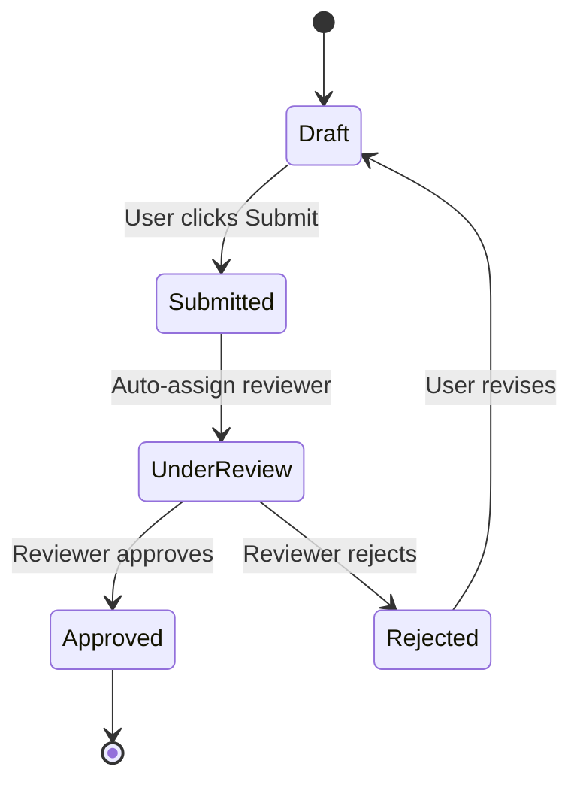

# PRD Builder Complete Usage Guide

**Version 1.0** | Last Updated: 2026-02-13

A comprehensive guide to the PRD Builder system - a Claude Code skill suite for creating, analyzing, and managing Product Requirements Documents.

---

## Table of Contents

1. [Introduction & Quick Start](#introduction--quick-start)
2. [Template Selection Guide](#template-selection-guide)
3. [Individual Skill Reference](#individual-skill-reference)
4. [Workflow Patterns](#workflow-patterns)
5. [Quality & Scoring Guide](#quality--scoring-guide)
6. [Best Practices](#best-practices)
7. [Anti-Patterns & Common Mistakes](#anti-patterns--common-mistakes)
8. [Advanced Usage](#advanced-usage)
9. [Troubleshooting](#troubleshooting)

---

## Introduction & Quick Start

### What is PRD Builder?

PRD Builder is a comprehensive system of 12 Claude Code skills that help you create, analyze, and manage Product Requirements Documents. It enforces quality through structured templates, automated analysis, and iterative refinement.

### 30-Second Quick Start

```bash
# 1. Start a new PRD
/prd-discover my-feature

# 2. Generate the PRD
/prd-draft prd/my-feature/prd-context-my-feature.md

# 3. Check quality
/prd-analyze prd/my-feature/prd.md

# 4. Improve if needed
/prd-refine prd/my-feature/prd.md

# 5. Generate artifacts
/prd-export prd/my-feature/prd.md
/prd-tasks prd/my-feature/prd.md
```

### System Architecture

```
┌─────────────────────────────────────────────────────────────┐
│                    PRD BUILDER SYSTEM                        │
├─────────────────────────────────────────────────────────────┤
│                                                              │
│  CORE PIPELINE                                               │
│  ┌──────────┐   ┌──────────┐   ┌──────────┐   ┌──────────┐│
│  │ discover │──▶│  draft   │──▶│ analyze  │──▶│  refine  ││
│  └──────────┘   └──────────┘   └──────────┘   └──────────┘│
│       │              │              │              │        │
│       └──────────────┴──────────────┴──────────────┘        │
│                          │                                  │
│  INCREMENTAL UPDATES     │                                  │
│  ┌─────────────┐         │                                  │
│  │ add-feature │─────────┘                                  │
│  └─────────────┘                                            │
│                                                              │
│  POST-PIPELINE                                               │
│  ┌──────────┐   ┌──────────┐   ┌──────────┐               │
│  │  export  │   │  tasks   │   │ diagram  │               │
│  └──────────┘   └──────────┘   └──────────┘               │
│                                                              │
│  ANALYSIS & NAVIGATION                                       │
│  ┌──────────┐   ┌──────────┐   ┌──────────┐   ┌──────────┐│
│  │  status  │   │ validate │   │   diff   │   │  search  ││
│  └──────────┘   └──────────┘   └──────────┘   └──────────┘│
│                                                              │
└─────────────────────────────────────────────────────────────┘

OUTPUT STRUCTURE:

prd/
└── my-feature/
    ├── prd.md                      ← Main PRD document
    ├── prd-context-my-feature.md   ← Discovery session output
    ├── prd-<sub-feature>.md        ← Feature documents (hub-and-spoke)
    ├── prd-summary.md              ← Stakeholder summary
    ├── tasks.md                    ← Implementation tasks
    └── diagrams/
        ├── state-machine.mmd
        ├── user-flow.mmd
        └── data-model.mmd
```

---

## Template Selection Guide

PRD Builder supports 4 template types, each optimized for different use cases.

### Template Comparison

| Template | Sections | Rubric | Threshold | Best For | Time to Draft |
|----------|----------|--------|-----------|----------|---------------|
| **Full PRD** | 22 | 54 pts | ≥43 (80%) | Standard features, complete documentation | 30-60 min |
| **1-Pager** | 7 | 20 pts | ≥16 (80%) | Small features, quick alignment | 10-15 min |
| **Shape Up Pitch** | 6 | 16 pts | ≥13 (81%) | Fixed-timeboxed work, proposals | 15-20 min |
| **AI Product PRD** | 27 | 64 pts | ≥52 (81%) | AI/ML features, model-driven products | 45-90 min |
| **Feature Document** | 11 | 14 pts | ≥9 (64%) | Adding features to existing PRDs | 15-30 min |

### Decision Tree

```
START: What type of PRD do I need?
  │
  ├─ Is this an AI/ML feature?
  │  (LLM integration, recommendation engine, classification, prediction)
  │  YES → Use --format ai (AI Product PRD)
  │         Includes: Model performance requirements, data dependencies,
  │                   failure modes, ethical considerations, drift detection
  │
  └─ NO
     │
     ├─ Is this a quick proposal or pitch?
     │  (Shape Up methodology, fixed appetite, "fat-marker sketch")
     │  YES → Use --format pitch (Shape Up Pitch)
     │         Includes: Appetite, breadboarding, rabbit holes, no-gos
     │
     └─ NO
        │
        ├─ Is this a small, focused feature?
        │  (< 2 weeks scope, limited complexity, early-stage idea)
        │  YES → Use --format 1pager (1-Pager)
        │         Includes: Problem, hypothesis, solution overview, risks
        │
        └─ NO → Use default (Full PRD)
                Includes: Complete 22-section documentation
```

### Template Details

#### Full PRD (Default)
**Use when:**
- Building standard product features
- Need complete technical specifications
- Coordinating across multiple teams
- Documenting APIs, data models, and integrations

**Sections (22 total):**
- Required (12): Metadata, Executive Summary, Problem Statement, Goals/KPIs, Users, Flows, Requirements, Data Model, Error States, NFRs, Assumptions, Scope, Acceptance Criteria
- Recommended (4): Competitive Landscape, UI/UX Specs, Risks, Release Phases
- Conditional (6): API Contracts, State Machines, Dependencies, Observability, Glossary, Decisions Log

**Quality criteria:**
- Specific, measurable, testable requirements
- Given/When/Then acceptance criteria
- Data model with field types and validation rules
- Explicit prioritization (P0/P1/P2)

#### 1-Pager
**Use when:**
- Proposing a small feature or improvement
- Need quick stakeholder alignment
- Early-stage ideas that need validation
- Time-constrained decision-making

**Sections (7 total):**
1. Metadata
2. Problem (specific user segment, observable pain, evidence, why now)
3. Hypothesis (we believe X will Y, we'll know when Z)
4. Goals (2-3 measurable objectives)
5. Solution Overview (high-level, concise)
6. Key Risks (top 3 things that could fail)
7. Timeline (milestones and go/no-go points)

**Quality criteria:**
- Evidence-based problem statement
- Falsifiable hypothesis
- Measurable goals
- Risk mitigation strategies

#### Shape Up Pitch
**Use when:**
- Following Basecamp's Shape Up methodology
- Fixed time budget (Small Batch 1-2 weeks OR Big Batch 6 weeks)
- Need to define boundaries and exclusions explicitly
- Proposing work for a build cycle

**Sections (6 total):**
1. Metadata (includes Appetite field)
2. Problem (raw idea, motivation, current workaround, why now)
3. Appetite (time budget and scope constraints)
4. Solution (fat-marker sketch + breadboarding)
5. Rabbit Holes (technical risks and complexity traps to avoid)
6. No-Gos (explicit exclusions with rationale)

**Quality criteria:**
- Clear appetite definition
- Solution sketched at right level (not wireframes, not pseudocode)
- Rabbit holes identified upfront
- Explicit boundary setting

#### AI Product PRD
**Use when:**
- Building AI/ML-powered features
- Integrating LLMs or foundation models
- Creating recommendation systems
- Implementing classification or prediction models
- Need to specify model performance, data pipelines, and ethical considerations

**Sections (27 total):**
- All 22 sections from Full PRD
- Plus 5 AI-specific sections:
  - Model Performance Requirements (accuracy, latency, throughput, constraints)
  - Data Dependencies & Pipeline (sources, quality, labeling, versioning, PII)
  - Failure Modes & Fallbacks (what happens when model fails)
  - Ethical Considerations & Bias (fairness, detection, mitigation)
  - Monitoring & Drift Detection (performance monitoring, data drift)

**Quality criteria:**
- Quantified model performance targets
- Data quality requirements specified
- Fallback behavior defined
- Bias detection and mitigation plan
- Drift detection thresholds

---

## Individual Skill Reference

### Core Pipeline Skills

---

#### 1. `/prd-discover <feature-name>`

**Purpose:** Structured discovery session to gather comprehensive context before writing a PRD.

**Type:** Interactive | **Tools:** AskUserQuestion, Write | **Time:** 10-30 min

**Input:**
- Feature name (required) - used to create output file path
- OR run without arguments for interactive prompt

**Output:**
- `prd/<feature-name>/prd-context-<feature-name>.md`

**What it does:**
Asks 8 targeted questions to gather context:
1. **Problem Statement** - What problem are you solving? For whom?
2. **Evidence** - What evidence validates this problem?
3. **Target Users** - Who are the primary users and their roles?
4. **Scope** - What's in scope? What's explicitly out of scope?
5. **Constraints** - Technical, business, or regulatory constraints?
6. **Success Criteria** - How will you measure success? What are the KPIs?
7. **Competitive Landscape** - How do competitors solve this? What's unique?
8. **Detail Level** - What level of detail do you need? (determines template)

**Recommended Prompts:**

```bash
# Start discovery for a new feature
/prd-discover user-authentication

# Start discovery for complex feature (will guide to Full PRD)
/prd-discover payment-processing

# Start discovery for small feature (will guide to 1-Pager)
/prd-discover dark-mode-toggle

# Start discovery for AI feature (will guide to AI Product PRD)
/prd-discover recommendation-engine
```

**Follow-up Actions:**
After discovery completes:
1. Review the generated context file
2. Run `/prd-draft prd/<feature-name>/prd-context-<feature-name>.md` to generate PRD
3. The template type is auto-detected from the "Detail Level" section

**Tips:**
- Provide substantive answers for questions 1-3 at minimum
- Use specific evidence (metrics, user quotes, research data)
- Be explicit about what's out of scope
- The "Detail Level" response determines which template is used

---

#### 2. `/prd-draft [--format 1pager|pitch|ai] <context-file-or-brief>`

**Purpose:** Generate a complete first-draft PRD from context file or inline brief.

**Type:** Automated | **Tools:** Read, Write | **Time:** 5-15 min

**Input:**
- `--format` flag (optional): `1pager`, `pitch`, `ai`, or omit for auto-detection
- Context file path (from `/prd-discover`) OR inline feature description

**Output:**
- `prd/<feature-name>/prd.md`
- If file exists, creates `prd-v2.md`, `prd-v3.md`, etc.

**Format Detection Hierarchy:**
1. Explicit `--format` flag (highest priority)
2. Context file's "Detail Level" section
3. Default to Full PRD

**Recommended Prompts:**

```bash
# Generate PRD from context file (auto-detects format)
/prd-draft prd/user-authentication/prd-context-user-authentication.md

# Generate 1-Pager from inline brief
/prd-draft --format 1pager "Add dark mode toggle to user preferences. Users report eye strain from bright interface during evening use."

# Generate Shape Up Pitch from context file
/prd-draft --format pitch prd/notification-center/prd-context-notification-center.md

# Generate AI Product PRD from context file
/prd-draft --format ai prd/content-moderation/prd-context-content-moderation.md

# Generate Full PRD from inline brief (for quick iteration)
/prd-draft "Build a user profile page with avatar upload, bio editing, and privacy settings"
```

**What it does:**
1. Resolves input (file path vs. inline text)
2. Determines PRD type from format flag or context
3. Derives output path from feature name
4. Generates complete PRD using appropriate template
5. Writes to `prd/<feature-name>/prd.md`

**Quality Markers:**
- Uses `[NEEDS EVIDENCE]` if evidence gaps exist
- Uses `[NEEDS INPUT]` for unclear sections
- Never pads with filler content
- Includes revision history entry

**Follow-up Actions:**
1. Run `/prd-validate prd/<feature-name>/prd.md` for quick structural check
2. Run `/prd-analyze prd/<feature-name>/prd.md` for full quality analysis
3. If issues found, run `/prd-refine prd/<feature-name>/prd.md`

**Tips:**
- Use context files for complex features (better results)
- Use inline briefs for quick iterations or small features
- Explicit `--format` flag overrides auto-detection
- Review generated PRD before sharing

---

#### 3. `/prd-analyze <prd-file-path>`

**Purpose:** Comprehensive quality analysis using type-specific rubric (54/20/16/64 points).

**Type:** Read-only Reporter | **Tools:** Read, Glob, Grep | **Time:** 3-5 min

**Input:**
- Path to PRD markdown file (required)

**Output:**
- Terminal report only (does NOT modify file)

**What it does:**
1. **Auto-detects PRD type** from metadata (`Type:` field)
2. **Scores PRD** using type-specific rubric:
   - Full PRD: 54 points (27 criteria)
   - 1-Pager: 20 points (10 criteria)
   - Shape Up Pitch: 16 points (8 criteria)
   - AI Product PRD: 64 points (32 criteria)
3. **Identifies issues** by severity: CRITICAL / HIGH / MEDIUM / LOW
4. **Checks section completeness** (required/recommended/conditional)
5. **Provides remediation recommendations**

**Analysis Passes:**
- **Completeness**: Required/recommended/conditional sections present
- **Duplication**: Redundant requirements or rules
- **Ambiguity**: Vague adjectives, placeholders, conditional language
- **Solution-as-problem**: "Users can't [feature]" anti-pattern
- **Underspecification**: Requirements without acceptance criteria
- **Internal consistency**: Terminology drift, data model mismatches
- **Quality signals**: Missing metadata, empty sections, assumptions

**Recommended Prompts:**

```bash
# Analyze PRD quality
/prd-analyze prd/user-authentication/prd.md

# Analyze before stakeholder review
/prd-analyze prd/payment-processing/prd.md

# Analyze after major edits
/prd-analyze prd/notification-center/prd.md

# Check if ready for implementation
/prd-analyze prd/dashboard-widgets/prd.md
```

**Output Structure:**
```
PRD Quality Analysis Report
━━━━━━━━━━━━━━━━━━━━━━━━━━━━━

File: prd/user-authentication/prd.md
Type: Full PRD
Date: 2026-02-13

SCORE: 38/54 (70%) - GOOD
Quality Rating: Good (needs improvement before implementation)

RUBRIC SCORECARD (27 criteria):
┌────────────────────────────────────────┬───────┐
│ Criterion                              │ Score │
├────────────────────────────────────────┼───────┤
│ Problem: Specific user segment         │  2/2  │
│ Problem: Observable pain               │  2/2  │
│ Problem: Evidence                      │  1/2  │ ← Needs improvement
...

FINDINGS (12 total):
┌────┬──────────┬─────────────────────────────────────┬─────────────────┐
│ ID │ Severity │ Finding                             │ Section         │
├────┼──────────┼─────────────────────────────────────┼─────────────────┤
│ C1 │ CRITICAL │ Missing required section: API...    │ Section 9       │
│ A2 │ HIGH     │ Ambiguous success criteria: "fast"  │ Goals & KPIs    │
...

SECTION COMPLETENESS:
Required (12): 11/12 present ⚠️
Recommended (4): 3/4 present ✓
Conditional (6): 2/6 present (context-dependent)

NEXT ACTIONS:
1. [CRITICAL] Add missing API & Integration Contracts section
2. [HIGH] Specify quantified latency target for "fast response"
3. Run /prd-refine to systematically improve quality
```

**Quality Thresholds:**
- **Full PRD**: ≥43/54 (80%) with no CRITICAL issues
- **1-Pager**: ≥16/20 (80%) with no CRITICAL issues
- **Shape Up Pitch**: ≥13/16 (81%) with no CRITICAL issues
- **AI Product PRD**: ≥52/64 (81%) with no CRITICAL issues

**Tips:**
- Run after drafting to identify issues early
- Use as quality gate before implementation
- CRITICAL findings must be addressed before proceeding
- Report is read-only - use `/prd-refine` to fix issues

---

#### 4. `/prd-refine <prd-file-path>`

**Purpose:** Iteratively improve PRD based on analysis findings through interactive session.

**Type:** Interactive | **Tools:** Read, Write, AskUserQuestion, Skill | **Time:** 15-45 min

**Input:**
- Path to PRD markdown file (required)

**Output:**
- Updated PRD (in-place modification)
- Final quality score report

**What it does:**
1. **Runs `/prd-analyze`** internally to assess current quality
2. **Presents summary** (score, findings by severity, top issues)
3. **Walks through sections** prioritized by severity (CRITICAL first)
4. **Asks targeted questions** to fill gaps and resolve issues
5. **Updates PRD incrementally** after each section
6. **Re-runs analysis** as final quality gate
7. **Checks final score** against type-specific threshold

**Priority Order:**
1. Missing required sections
2. Underspecified requirements
3. Missing acceptance criteria
4. Missing error states
5. Ambiguities and terminology drift
6. Missing recommended/conditional sections

**Recommended Prompts:**

```bash
# Improve PRD to meet quality standards
/prd-refine prd/user-authentication/prd.md

# Address analysis findings interactively
/prd-refine prd/payment-processing/prd.md

# Refine after stakeholder feedback
/prd-refine prd/notification-center/prd.md

# Polish PRD before implementation kickoff
/prd-refine prd/dashboard-widgets/prd.md
```

**Typical Session Flow:**
```
1. Initial Analysis
   → "Your PRD scores 38/54 (70%). Found 3 CRITICAL, 5 HIGH issues."

2. Section-by-Section Refinement
   → "Let's address the missing API Contracts section (CRITICAL)"
   → Asks: "What external APIs does this integrate with?"
   → Asks: "What are the request/response formats?"
   → Updates PRD with API section

3. Iterative Improvement
   → Continues through all CRITICAL/HIGH issues
   → Asks clarifying questions per section
   → Saves after each section

4. Final Quality Gate
   → Re-runs analysis
   → "Your PRD now scores 47/54 (87%) - EXCELLENT"
   → "No CRITICAL findings remaining ✓"
```

**Success Criteria:**
- **Full PRD**: ≥35/54 with no CRITICAL findings
- **1-Pager**: ≥13/20 with no CRITICAL findings
- **Shape Up Pitch**: ≥10/16 with no CRITICAL findings
- **AI Product PRD**: ≥42/64 with no CRITICAL findings

**Tips:**
- Allocate 15-45 minutes depending on complexity
- Answer questions thoroughly for best results
- Process saves incrementally (safe to interrupt)
- Final score must meet threshold before implementation

---

#### 4b. `/prd-add-feature <parent-prd-path> [feature-name]`

**Purpose:** Add a new feature to an existing PRD — as a separate feature document or in-place update.

**Type:** Interactive | **Tools:** Read, Write, AskUserQuestion | **Time:** 15-30 min

**Input:**
- Path to parent PRD file (required)
- Feature name (optional, will be prompted if missing)

**Output:**
- **Separate document mode:** `prd/<parent-folder>/prd-<feature-name>.md` + updated parent PRD (Feature Index + Revision History)
- **In-place update mode:** Updated parent PRD with version bump, change history, and `[Added v<version>]` content tags

**What it does:**
1. Reads parent PRD to understand current product scope, personas, goals
2. Asks 5 targeted discovery questions scoped to the new feature
3. Recommends separate document vs. in-place update (user chooses)
4. Creates feature document or updates parent PRD with proper versioning
5. Maintains bidirectional linking and ripple-effect updates

**Discovery Questions:**
1. **Problem** — What specific problem does this feature solve?
2. **Scope** — What's in scope? What's out?
3. **Success criteria** — How will you measure success?
4. **Impact** — Does this affect existing features?
5. **Users** — Which personas are affected?

**Two Modes:**

**Separate Feature Document (recommended for most cases):**
- Creates lightweight 11-section feature document using `prd-feature-template.md`
- Includes "Link to Parent PRD" header
- Adds entry to parent PRD's Feature Index section
- Logs change in parent's Revision History

**In-Place Update:**
- Bumps version number (minor increment)
- Tags new content with `[Added v<new-version>]`
- Updates ripple-effect sections: Goals, Non-Goals, Scope, Users, Data Model, Errors, Dependencies, Timeline

**Recommended Prompts:**

```bash
# Add a feature to an existing PRD (separate document)
/prd-add-feature prd/fixtureflow/prd.md player-stats

# Add a small enhancement (likely in-place)
/prd-add-feature prd/user-auth/prd.md password-reset

# Interactive — will prompt for feature name
/prd-add-feature prd/my-product/prd.md
```

**When to Use Separate Document:**
- Feature has its own problem statement
- Needs its own success metrics
- Complex enough for dedicated review
- Can be understood independently

**When to Use In-Place Update:**
- Small enhancement to existing feature
- Separate document would be overhead
- Change alters product scope/vision

**Follow-up Actions:**
1. Run `/prd-validate <path>` to check structural integrity
2. Run `/prd-analyze <path>` to check quality
3. Run `/prd-refine <path>` to improve the document

**Tips:**
- Always provide a clear problem statement distinct from the parent PRD
- Separate documents are recommended for anything with its own success metrics
- The skill never deletes or overwrites existing content — only adds or annotates

---

### Post-Pipeline Skills

---

#### 5. `/prd-export <prd-file-path>`

**Purpose:** Generate condensed stakeholder-friendly executive summary (1-2 pages).

**Type:** Automated | **Tools:** Read, Write | **Time:** 3-5 min

**Input:**
- Path to PRD markdown file (required)

**Output:**
- `prd/<feature-name>/prd-summary.md`
- If file exists, creates `prd-summary-v2.md`, etc.

**What it does:**
Extracts and condenses key sections:
1. Metadata (title, version, status, author, date)
2. Executive Summary
3. Goals & KPIs
4. Scope (in/out)
5. Release Phases (if present)
6. Risks (if present)
7. Open Questions (if present)

**Output format:**
- Title + metadata block
- Overview (2-3 paragraph synthesis)
- Goals & metrics (bulleted + table)
- Scope (in/out subsections)
- Release plan (phase summary)
- Key risks (top 3-5 with mitigations)
- Open questions
- Link back to full PRD

**Recommended Prompts:**

```bash
# Create executive summary for stakeholders
/prd-export prd/user-authentication/prd.md

# Generate summary before leadership review
/prd-export prd/payment-processing/prd.md

# Create condensed version for external partners
/prd-export prd/api-integration/prd.md

# Prepare summary for kickoff meeting
/prd-export prd/dashboard-widgets/prd.md
```

**Content Rules:**
- **Condense, don't copy-paste** - synthesize information
- **Preserve specifics** - keep numbers, dates, priorities, KPI values exact
- **Omit implementation details** - no data models, API contracts, acceptance criteria
- **Keep under 300 lines total**
- **Include source path link** for full details

**Best for:**
- Stakeholder briefings
- Leadership reviews
- Cross-team alignment
- External partner communication

**Tips:**
- Run after PRD is refined and approved
- Review before sharing externally
- Include link to full PRD for technical details
- Update summary if PRD changes significantly

---

#### 6. `/prd-tasks <prd-file-path>`

**Purpose:** Extract structured implementation task breakdown from functional requirements.

**Type:** Automated | **Tools:** Read, Write | **Time:** 5-10 min

**Input:**
- Path to PRD markdown file (required)

**Output:**
- `prd/<feature-name>/tasks.md`
- If file exists, creates `tasks-v2.md`, etc.

**What it does:**
1. **Extracts requirements** from Functional Requirements, Data Model, API Contracts, Acceptance Criteria
2. **Organizes by priority**: P0 (Must), P1 (Should), P2 (Could)
3. **Groups by feature area**: Setup & Infrastructure first, then by domain
4. **Generates task table** with attributes:
   - Task ID (sequential within priority)
   - Description (imperative verb: Create, Implement, Add, Configure)
   - Source (requirement ID from PRD)
   - Complexity: S (<2 hrs), M (2-8 hrs), L (>8 hrs)
   - Dependencies (task numbers)
   - Acceptance Criteria (reference or summary)

**Recommended Prompts:**

```bash
# Generate implementation tasks
/prd-tasks prd/user-authentication/prd.md

# Create task breakdown for sprint planning
/prd-tasks prd/payment-processing/prd.md

# Extract tasks for estimation
/prd-tasks prd/notification-center/prd.md

# Generate backlog from PRD
/prd-tasks prd/dashboard-widgets/prd.md
```

**Output Structure:**
```markdown
# Implementation Tasks: User Authentication

Generated from: prd/user-authentication/prd.md
Date: 2026-02-13

## Summary
- Total Tasks: 58
- Priority Breakdown: P0: 43, P1: 10, P2: 5
- Complexity Breakdown: S: 22, M: 28, L: 8

## P0 Tasks (Must Have)

### Setup & Infrastructure
| ID | Task | Source | Complexity | Dependencies | Acceptance Criteria |
|----|------|--------|------------|--------------|---------------------|
| P0-1 | Set up authentication database schema | FR-AUTH-01 | M | - | Schema matches data model in Section 8 |
| P0-2 | Configure JWT secret management | FR-AUTH-02 | S | P0-1 | Secrets stored in env variables |
...

### User Registration
| ID | Task | Source | Complexity | Dependencies | Acceptance Criteria |
|----|------|--------|------------|--------------|---------------------|
| P0-5 | Implement email validation | FR-AUTH-05 | S | P0-1 | AC-AUTH-05 |
...
```

**Task Attributes:**
- **Task ID**: Unique identifier (P0-1, P1-3, etc.)
- **Description**: Clear, actionable (starts with verb)
- **Source**: Requirement ID from PRD
- **Complexity**:
  - S (Small): < 2 hours
  - M (Medium): 2-8 hours
  - L (Large): > 8 hours
- **Dependencies**: Tasks that must complete first
- **Acceptance Criteria**: Reference to PRD section or inline summary

**Best for:**
- Sprint planning
- Effort estimation
- Developer assignment
- Progress tracking

**Tips:**
- Run after PRD is finalized
- Use as input for project management tools
- Preserves PRD priority assignments (doesn't re-prioritize)
- Marks vague requirements with `[NEEDS CLARIFICATION]`

---

#### 7. `/prd-diagram <prd-file-path> [type]`

**Purpose:** Generate Mermaid diagrams from structured PRD sections.

**Type:** Automated | **Tools:** Read, Write | **Time:** 5-10 min

**Input:**
- Path to PRD markdown file (required)
- Diagram type (optional): `state-machine`, `user-flow`, `data-model`, or `all`

**Output:**
- `prd/<feature-name>/diagrams/<type>.mmd`
- If multiple entities: `prd/<feature-name>/diagrams/<type>-<entity>.mmd`

**Diagram Types:**

**1. State Machine** (from Section 10: State Machines & Lifecycle)
- Format: Mermaid `stateDiagram-v2`
- Extracts: State transition tables (From → Trigger → To)
- Includes: Initial `[*]` and terminal states
- Multiple entities: Separate files per entity

**2. User Flow** (from Section 6: User Stories & Flows)
- Format: Mermaid `flowchart TD`
- Extracts: Numbered flow steps, conditionals, decision points
- Includes: Sequential arrows, diamond nodes for conditionals
- Multiple flows: Separate files per major flow

**3. Data Model** (from Section 8: Data Model & Validation Rules)
- Format: Mermaid `erDiagram`
- Extracts: Entities, fields, relationships
- Includes: Cardinality notation (`||--o{`, `||--||`, `}o--o{`)
- Shows: Field types and key constraints

**Recommended Prompts:**

```bash
# Generate all diagrams from PRD
/prd-diagram prd/user-authentication/prd.md all

# Generate only state machine diagram
/prd-diagram prd/order-processing/prd.md state-machine

# Generate only user flow diagram
/prd-diagram prd/checkout-flow/prd.md user-flow

# Generate only data model diagram
/prd-diagram prd/inventory-management/prd.md data-model

# Default (same as "all")
/prd-diagram prd/payment-processing/prd.md
```

**Example Output:**



**Constraints:**
- Keeps diagrams under 50 nodes (splits if larger)
- Uses descriptive labels (not cryptic IDs)
- Skips diagram type if source section insufficient
- Notes missing sections in report

**Best for:**
- Developer onboarding
- Presentations and demos
- Architecture reviews
- Documentation

**Tips:**
- Run after PRD is finalized
- View `.mmd` files in Mermaid-compatible viewers
- Use `all` for comprehensive visual documentation
- Diagrams reflect PRD state at generation time

---

### Analysis & Navigation Skills

---

#### 8. `/prd-status [optional-filter]`

**Purpose:** Dashboard showing all PRDs with status and health assessment.

**Type:** Read-only Reporter | **Tools:** Read, Glob, Grep | **Time:** 2-5 min

**Input:**
- None required
- Optional filter keyword (status or feature name substring)

**Output:**
- Terminal dashboard report

**What it does:**
1. **Scans** all `prd/*/prd.md` files
2. **Extracts** metadata, status, version, section count, word count
3. **Assesses health** using heuristics:
   - Ready: 12/12 required sections, no placeholders
   - Good: 10-11 required sections, ≤2 placeholders
   - Needs Work: 7-9 required sections OR >2 placeholders
   - Incomplete: <7 required sections
4. **Identifies artifacts** (context, summary, tasks, diagrams)
5. **Highlights** PRDs needing attention

**Recommended Prompts:**

```bash
# View all PRDs
/prd-status

# Filter by status
/prd-status draft
/prd-status approved

# Filter by feature name
/prd-status authentication
/prd-status payment

# Check what needs attention
/prd-status "needs work"
```

**Output Structure:**
```
PRD Portfolio Dashboard
━━━━━━━━━━━━━━━━━━━━━━━━━━━━━

OVERVIEW (5 PRDs total):
┌───────────────────────┬────────────┬─────────┬─────────┬──────────┬───────┬────────────┐
│ PRD                   │ Status     │ Version │ Health  │ Sections │ Words │ Updated    │
├───────────────────────┼────────────┼─────────┼─────────┼──────────┼───────┼────────────┤
│ user-authentication   │ Approved   │ 2.0     │ Ready   │ 22/22    │ 4,521 │ 2026-02-10 │
│ payment-processing    │ Draft      │ 1.0     │ Good    │ 20/22    │ 3,102 │ 2026-02-13 │
│ notification-center   │ In Review  │ 1.5     │ Good    │ 19/22    │ 2,847 │ 2026-02-12 │
│ dark-mode-toggle      │ Draft      │ 1.0     │ Needs   │ 5/7      │ 892   │ 2026-02-11 │
│ recommendation-ai     │ Draft      │ 0.5     │ Incompl │ 18/27    │ 2,234 │ 2026-02-09 │
└───────────────────────┴────────────┴─────────┴─────────┴──────────┴───────┴────────────┘

ARTIFACTS:
┌───────────────────────┬─────────┬─────────┬───────┬────────────┬──────────────┐
│ PRD                   │ Context │ Summary │ Tasks │ Diagrams   │ Placeholders │
├───────────────────────┼─────────┼─────────┼───────┼────────────┼──────────────┤
│ user-authentication   │ ✓       │ ✓       │ ✓     │ ✓ (3)      │ 0            │
│ payment-processing    │ ✓       │ ✗       │ ✗     │ ✗          │ 2            │
│ notification-center   │ ✓       │ ✓       │ ✗     │ ✓ (2)      │ 1            │
│ dark-mode-toggle      │ ✓       │ ✗       │ ✗     │ ✗          │ 4            │
│ recommendation-ai     │ ✓       │ ✗       │ ✗     │ ✗          │ 8            │
└───────────────────────┴─────────┴─────────┴───────┴────────────┴──────────────┘

ATTENTION NEEDED:
• dark-mode-toggle: Missing 2 required sections, 4 placeholders
• recommendation-ai: Missing 9 required sections, 8 placeholders

MISSING ARTIFACTS:
• payment-processing: No summary, tasks, or diagrams
• dark-mode-toggle: No summary, tasks, or diagrams
• recommendation-ai: No summary, tasks, or diagrams
```

**Health Assessment:**
- **Ready**: All required sections present, no placeholders - ready for implementation
- **Good**: Minor gaps, ready for review
- **Needs Work**: Significant gaps, run `/prd-analyze` and `/prd-refine`
- **Incomplete**: Major gaps, consider restarting with `/prd-discover`

**Tips:**
- Run at start of session to see portfolio state
- Fast heuristic assessment (not comprehensive - use `/prd-analyze` for deep review)
- Identifies quick wins (PRDs ready for export/tasks/diagrams)
- Filter by status to focus on specific PRDs

---

#### 9. `/prd-validate <prd-file-path>`

**Purpose:** Fast structural lint check (mechanical validation only).

**Type:** Read-only Reporter | **Tools:** Read, Glob, Grep | **Time:** 1-2 min

**Input:**
- Path to PRD markdown file (required)

**Output:**
- Terminal pass/fail report

**What it does:**
Performs 16 mechanical/structural checks:
1. Document title present
2. Required sections present (12 total)
3. Sections at correct heading level (`##`)
4. Sections in template order
5. Version field present
6. Status field valid (Draft, In Review, Approved, Active Development)
7. Last Updated date present
8. Author field present
9. Revision history table exists
10. No placeholders (`[NEEDS INPUT]`, `TODO`, `TBD`, `???`)
11. No "to be determined" phrases
12. Requirement IDs present (e.g., `FR-XXX-##`)
13. Priority labels present (P0/P1/P2 or MoSCoW)
14. Acceptance criteria use Given/When/Then format
15. Table integrity (header rows, consistent columns)
16. KPI table with numeric targets exists
17. Document not a stub (>200 lines)
18. No empty sections

**Recommended Prompts:**

```bash
# Quick structural check during editing
/prd-validate prd/user-authentication/prd.md

# Verify structure before analysis
/prd-validate prd/payment-processing/prd.md

# Check if ready for review (fast)
/prd-validate prd/notification-center/prd.md

# Lint check after manual edits
/prd-validate prd/dashboard-widgets/prd.md
```

**Output Structure:**
```
PRD Structural Validation
━━━━━━━━━━━━━━━━━━━━━━━━━━━━━

File: prd/user-authentication/prd.md
Date: 2026-02-13

CHECKS (16 total):
┌────┬─────────────────────────────────────────┬────────┐
│ #  │ Check                                   │ Result │
├────┼─────────────────────────────────────────┼────────┤
│ 1  │ Document title present                  │ PASS ✓ │
│ 2  │ Required sections present (12)          │ PASS ✓ │
│ 3  │ Sections at correct heading level       │ PASS ✓ │
│ 4  │ Sections in template order              │ FAIL ✗ │
│ 5  │ Version field present                   │ PASS ✓ │
│ 6  │ Status field valid                      │ PASS ✓ │
│ 7  │ Last Updated date present               │ PASS ✓ │
│ 8  │ Author field present                    │ PASS ✓ │
│ 9  │ Revision history table exists           │ PASS ✓ │
│ 10 │ No placeholders                         │ FAIL ✗ │
│ 11 │ Requirement IDs present                 │ PASS ✓ │
│ 12 │ Priority labels present                 │ PASS ✓ │
│ 13 │ Acceptance criteria format (G/W/T)      │ PASS ✓ │
│ 14 │ Table integrity                         │ PASS ✓ │
│ 15 │ KPI table with numeric targets          │ PASS ✓ │
│ 16 │ Document not a stub (>200 lines)        │ PASS ✓ │
└────┴─────────────────────────────────────────┴────────┘

SUMMARY: 14/16 PASS

FAILURES:
✗ Check 4: Sections out of order - "API Contracts" before "Data Model"
✗ Check 10: Found 2 placeholders: [NEEDS INPUT] in Section 9, [TODO] in Section 17

OVERALL: PASS (non-critical failures only)

SUGGESTED ACTIONS:
1. Reorder sections to match template
2. Replace placeholders with actual content
```

**Pass/Fail Criteria:**
- **PASS**: All checks pass OR only non-critical checks fail
- **FAIL**: Missing required sections, missing metadata, placeholders, no requirement IDs

**vs. `/prd-analyze`:**
- **validate**: Fast (1-2 min), structural only, mechanical checks
- **analyze**: Slower (3-5 min), semantic analysis, quality scoring, rubric

**Best for:**
- Quick checks during editing
- Pre-analysis validation
- CI/CD integration
- Fast quality gate

**Tips:**
- Run during editing for fast feedback
- Follow up with `/prd-analyze` for comprehensive review
- Mechanical only - doesn't assess content quality
- Faster than analysis (good for iterative editing)

---

#### 10. `/prd-diff <prd-file-path>` or `/prd-diff <file1> <file2>`

**Purpose:** Compare PRD versions showing section-by-section changes.

**Type:** Read-only Reporter | **Tools:** Read, Glob, Grep, Bash | **Time:** 2-3 min

**Input:**
- **Single file mode**: Path to PRD (compares vs. git HEAD)
- **Two-file mode**: Two file paths to compare

**Output:**
- Terminal diff report

**What it does:**
1. **Single file mode**: Runs `git show HEAD:<path>` to get committed version
2. **Two-file mode**: Reads both files directly
3. **Extracts sections** from each version (all `##` headings)
4. **Maps to template** using fuzzy matching
5. **Calculates word count** per section
6. **Compares sections**: Added / Removed / Modified / Unchanged

**Recommended Prompts:**

```bash
# Compare current PRD vs. last commit
/prd-diff prd/user-authentication/prd.md

# Compare before committing changes
/prd-diff prd/payment-processing/prd.md

# Compare two specific versions
/prd-diff prd/notification-center/prd.md prd/notification-center/prd-v2.md

# Review changes after refine session
/prd-diff prd/dashboard-widgets/prd.md
```

**Output Structure:**
```
PRD Version Comparison
━━━━━━━━━━━━━━━━━━━━━━━━━━━━━

Comparing: prd/user-authentication/prd.md
Previous: git HEAD (committed 2026-02-10)
Current:  Working copy (2026-02-13)

CHANGE SUMMARY:
• Sections Added: 2
• Sections Removed: 0
• Sections Modified: 5
• Sections Unchanged: 15
• Net Word Count: +487 words

SECTION CHANGES:
┌────┬─────────────────────────────────────┬──────────┬─────────────────────────┐
│ #  │ Section                             │ Status   │ Details                 │
├────┼─────────────────────────────────────┼──────────┼─────────────────────────┤
│ 1  │ Metadata & Revision History         │ Modified │ +23 words               │
│ 2  │ Executive Summary                   │ Modified │ +105 words              │
│ 7  │ Functional Requirements             │ Modified │ +234 words (8 new FRs)  │
│ 9  │ API & Integration Contracts         │ Added    │ 312 words               │
│ 13 │ Non-Functional Requirements         │ Modified │ +67 words               │
│ 14 │ Model Performance Requirements      │ Added    │ 189 words               │
│ 19 │ Acceptance Criteria                 │ Modified │ +98 words               │
│ ... │ (15 sections unchanged)            │ -        │ -                       │
└────┴─────────────────────────────────────┴──────────┴─────────────────────────┘

KEY CHANGES:
• Added API integration specifications for OAuth 2.0 provider
• Added Model Performance Requirements (converted to AI Product PRD)
• Expanded functional requirements from 12 to 20 items
• Updated acceptance criteria with 5 new Given/When/Then scenarios
• Enhanced NFRs with specific latency targets

RECOMMENDATIONS:
✓ Significant additions strengthen PRD quality
✓ New API section addresses previous CRITICAL finding
✗ Consider updating revision history with change rationale
```

**Change Types:**
- **Added**: Section exists in current but not previous
- **Removed**: Section exists in previous but not current (flag as concern)
- **Modified**: Section exists in both but content differs
- **Unchanged**: Identical content

**Best for:**
- Pre-commit review
- Post-refine validation
- Version comparison
- Change tracking

**Tips:**
- Single file mode requires git initialized repo
- Two-file mode works without git
- Reports "new PRD" if file not tracked
- Use before committing to review changes

---

#### 11. `/prd-search <search-query>`

**Purpose:** Full-text search across all PRDs with section-level context.

**Type:** Read-only Reporter | **Tools:** Read, Glob, Grep | **Time:** 2-5 min

**Input:**
- Search query (required, case-insensitive)

**Output:**
- Terminal search results report

**What it does:**
1. **Globs** all `prd/**/*.md` files
2. **Greps** for query (case-insensitive)
3. **Collects matches** with file path, line number, context
4. **Groups by PRD** folder
5. **Identifies section** (nearest preceding `##` heading)
6. **Formats results** with bold matched text

**Search Scope:**
- PRDs (`prd.md`)
- Context files (`prd-context-*.md`)
- Summaries (`prd-summary.md`)
- Tasks (`tasks.md`)

**Recommended Prompts:**

```bash
# Search for concept across all PRDs
/prd-search authentication

# Find specific requirement
/prd-search "FR-AUTH-05"

# Search for technology
/prd-search OAuth

# Find error handling patterns
/prd-search "error state"

# Search for specific KPI
/prd-search "conversion rate"
```

**Output Structure:**
```
PRD Search Results
━━━━━━━━━━━━━━━━━━━━━━━━━━━━━

Query: "authentication"
Total Matches: 47 across 3 PRDs

━━━━━━━━━━━━━━━━━━━━━━━━━━━━━
user-authentication (28 matches)
━━━━━━━━━━━━━━━━━━━━━━━━━━━━━

📄 prd.md (23 matches):

Section: Executive Summary
Line 15: "...provides secure **authentication** using OAuth 2.0..."
Line 18: "...multi-factor **authentication** for enterprise users..."

Section: Functional Requirements
Line 142: "FR-AUTH-01: System shall support **authentication** via email/password"
Line 145: "FR-AUTH-02: **Authentication** tokens expire after 24 hours"
...

📄 prd-summary.md (3 matches):

Section: Overview
Line 8: "...implement **authentication** system for web and mobile..."

📄 tasks.md (2 matches):

Section: P0 Tasks
Line 24: "P0-5: Implement **authentication** middleware"

━━━━━━━━━━━━━━━━━━━━━━━━━━━━━
payment-processing (12 matches)
━━━━━━━━━━━━━━━━━━━━━━━━━━━━━

📄 prd.md (10 matches):

Section: Dependencies & Third-Party SLAs
Line 287: "...requires **authentication** service availability..."
...

━━━━━━━━━━━━━━━━━━━━━━━━━━━━━
api-gateway (7 matches)
━━━━━━━━━━━━━━━━━━━━━━━━━━━━━

📄 prd.md (7 matches):
...

SUMMARY:
• PRDs with matches: 3
• Most matches in: user-authentication (28)
• Sections with most matches: Functional Requirements (15)
```

**Result Formatting:**
- **Bold matched text** within context
- Up to 80 characters context around match
- Line numbers for navigation
- Section headers for context
- Grouped by PRD, ordered by match count

**Limits:**
- Max 20 matches per PRD
- Max 100 total matches (notes overflow)
- Sorted PRDs by match count (most matches first)

**Best for:**
- Cross-PRD research
- Finding patterns
- Locating requirements
- Consistency checks

**Tips:**
- Use specific terms for better results
- Searches are case-insensitive
- Results include all file types in `prd/` directory
- Use quotes for exact phrase matching

---

## Workflow Patterns

### Fast Path (Small Features, 1-Pager)

**Use when:**
- Small, focused feature (<2 weeks scope)
- Quick stakeholder alignment needed
- Early-stage idea validation

**Steps:**
```bash
# 1. Discovery (10-15 min)
/prd-discover dark-mode-toggle

# 2. Generate 1-Pager (5 min)
/prd-draft prd/dark-mode-toggle/prd-context-dark-mode-toggle.md --format 1pager

# 3. Quick validation (2 min)
/prd-validate prd/dark-mode-toggle/prd.md

# 4. Done - ready for implementation
```

**Total time:** ~20 minutes

**Output:**
- `prd/dark-mode-toggle/prd-context-dark-mode-toggle.md`
- `prd/dark-mode-toggle/prd.md` (7-section 1-Pager)

**When to skip:**
- If feature is well-understood, skip discovery and use inline brief:
  ```bash
  /prd-draft --format 1pager "Add dark mode toggle to user preferences"
  ```

---

### Standard Path (Medium Features, Full PRD)

**Use when:**
- Standard product feature development
- Need complete technical specifications
- Coordinating across multiple teams

**Steps:**
```bash
# 1. Discovery (15-20 min)
/prd-discover user-authentication

# 2. Generate Full PRD (10 min)
/prd-draft prd/user-authentication/prd-context-user-authentication.md

# 3. Quality analysis (5 min)
/prd-analyze prd/user-authentication/prd.md

# 4. Refine if needed (15-30 min)
/prd-refine prd/user-authentication/prd.md

# 5. Generate stakeholder summary (3 min)
/prd-export prd/user-authentication/prd.md

# 6. Generate implementation tasks (5 min)
/prd-tasks prd/user-authentication/prd.md

# 7. Optional: Generate diagrams (5 min)
/prd-diagram prd/user-authentication/prd.md all
```

**Total time:** ~60-90 minutes

**Output:**
- `prd/user-authentication/prd-context-user-authentication.md`
- `prd/user-authentication/prd.md` (22-section Full PRD)
- `prd/user-authentication/prd-summary.md`
- `prd/user-authentication/tasks.md`
- `prd/user-authentication/diagrams/*.mmd`

**Quality gate:**
- After step 3: Must score ≥43/54 (80%) with no CRITICAL issues
- If below threshold, run step 4 (refine)

---

### Comprehensive Path (Complex Features, AI Product PRD)

**Use when:**
- AI/ML-powered features
- Model-driven products
- Need to specify performance, data pipelines, ethics

**Steps:**
```bash
# 1. Discovery (20-30 min)
/prd-discover recommendation-engine

# 2. Generate AI Product PRD (15 min)
/prd-draft prd/recommendation-engine/prd-context-recommendation-engine.md --format ai

# 3. Quality analysis (5 min)
/prd-analyze prd/recommendation-engine/prd.md

# 4. Refine iteratively (30-45 min)
/prd-refine prd/recommendation-engine/prd.md

# 5. Generate stakeholder summary (5 min)
/prd-export prd/recommendation-engine/prd.md

# 6. Generate implementation tasks (10 min)
/prd-tasks prd/recommendation-engine/prd.md

# 7. Generate diagrams (10 min)
/prd-diagram prd/recommendation-engine/prd.md all

# 8. Review portfolio status (2 min)
/prd-status
```

**Total time:** ~2-3 hours

**Output:**
- `prd/recommendation-engine/prd-context-recommendation-engine.md`
- `prd/recommendation-engine/prd.md` (27-section AI Product PRD)
- `prd/recommendation-engine/prd-summary.md`
- `prd/recommendation-engine/tasks.md`
- `prd/recommendation-engine/diagrams/*.mmd`

**Quality gate:**
- After step 3: Must score ≥52/64 (81%) with no CRITICAL issues
- AI-specific sections required: Model performance, data dependencies, failure modes, ethics, monitoring

---

### Incremental Update Path (Adding Features to Existing PRDs)

**Use when:**
- Adding a new feature to an existing product that already has a PRD
- Product is evolving and needs new capabilities documented
- Hub-and-spoke PRD architecture

**Steps:**
```bash
# 1. Check current PRD state
/prd-status my-product

# 2. Add the new feature
/prd-add-feature prd/my-product/prd.md notifications

# 3. Validate the new feature document (or updated parent)
/prd-validate prd/my-product/prd-notifications.md

# 4. Analyze quality
/prd-analyze prd/my-product/prd-notifications.md

# 5. Refine if needed
/prd-refine prd/my-product/prd-notifications.md

# 6. Generate tasks for the feature
/prd-tasks prd/my-product/prd-notifications.md

# Total: ~45-60 minutes
```

**Output (separate document mode):**
- `prd/my-product/prd-notifications.md` (feature document)
- Updated `prd/my-product/prd.md` (Feature Index + Revision History)

**Output (in-place mode):**
- Updated `prd/my-product/prd.md` with new content tagged `[Added v<version>]`

---

### Maintenance Workflow

**Use when:**
- Updating existing PRD based on feedback
- Tracking changes over time
- Ensuring quality after edits

**Steps:**
```bash
# 1. Check current status
/prd-status user-authentication

# 2. Make manual edits to PRD
# (edit prd/user-authentication/prd.md directly)

# 3. Validate structure after edits
/prd-validate prd/user-authentication/prd.md

# 4. Review changes
/prd-diff prd/user-authentication/prd.md

# 5. Re-analyze quality
/prd-analyze prd/user-authentication/prd.md

# 6. Refine if quality dropped
/prd-refine prd/user-authentication/prd.md

# 7. Regenerate artifacts if needed
/prd-export prd/user-authentication/prd.md
/prd-tasks prd/user-authentication/prd.md
```

**Best practices:**
- Always run validate/diff after manual edits
- Re-run analyze if significant changes made
- Regenerate summary/tasks if requirements changed
- Update revision history in PRD metadata

---

### Portfolio Management Workflow

**Use when:**
- Managing multiple PRDs
- Prioritizing work across features
- Finding patterns or dependencies

**Steps:**
```bash
# 1. View all PRDs
/prd-status

# 2. Filter to PRDs needing attention
/prd-status "needs work"

# 3. Search for cross-cutting concerns
/prd-search authentication
/prd-search "data privacy"

# 4. Prioritize improvements
# (identify PRDs with low health scores)

# 5. Batch refinement
/prd-refine prd/feature-a/prd.md
/prd-refine prd/feature-b/prd.md

# 6. Review status again
/prd-status
```

**Best for:**
- Team leads managing multiple features
- Identifying quick wins (PRDs ready for artifacts)
- Finding dependencies between PRDs
- Ensuring consistent quality across portfolio

---

## Quality & Scoring Guide

### Understanding Rubric Scores

Each PRD type has a specific rubric with point-based scoring:

| Template | Max Points | Criteria Count | Threshold | Pass Rate |
|----------|------------|----------------|-----------|-----------|
| Full PRD | 54 | 27 | ≥43 | 80% |
| 1-Pager | 20 | 10 | ≥16 | 80% |
| Shape Up Pitch | 16 | 8 | ≥13 | 81% |
| AI Product PRD | 64 | 32 | ≥52 | 81% |

### Scoring Mechanism

Each criterion is scored 0/1/2:
- **2 points**: Fully satisfies criterion (specific, measurable, complete)
- **1 point**: Partially satisfies (present but vague or incomplete)
- **0 points**: Missing or inadequate

**Example criteria (Full PRD):**

| Criterion | 0 pts | 1 pt | 2 pts |
|-----------|-------|------|-------|
| Problem: Specific user segment | No segment mentioned | Generic "users" | Specific role/persona |
| Problem: Observable pain | No pain described | Vague dissatisfaction | Quantified impact |
| Problem: Evidence | No evidence | Assertion only | Data/quote/research |
| Goals: Measurable KPIs | No KPIs | Qualitative goals | Quantified with baseline/target |

### Quality Ratings

**Full PRD (54 points):**
- **Excellent** (≥44): Ready for implementation, no improvements needed
- **Good** (32-43): Minor gaps, ready with targeted fixes
- **Fair** (22-31): Significant gaps, needs refinement
- **Weak** (11-21): Major issues, consider restarting
- **Incomplete** (<11): Not viable, restart with discovery

**1-Pager (20 points):**
- **Excellent** (≥16): Clear proposal, ready for decision
- **Good** (12-15): Minor clarifications needed
- **Fair** (8-11): Needs strengthening
- **Weak** (4-7): Insufficient for decision
- **Incomplete** (<4): Too vague, gather more context

**Shape Up Pitch (16 points):**
- **Excellent** (≥13): Well-shaped, ready for betting table
- **Good** (10-12): Needs minor shaping
- **Fair** (7-9): Underdefined appetite or solution
- **Weak** (4-6): Not ready for cycle planning
- **Incomplete** (<4): Needs more shaping work

**AI Product PRD (64 points):**
- **Excellent** (≥52): AI-specific concerns addressed, ready
- **Good** (39-51): Core solid, minor AI gaps
- **Fair** (26-38): Missing key AI considerations
- **Weak** (13-25): Insufficient AI specifications
- **Incomplete** (<13): Not viable for AI implementation

### Severity Levels

**CRITICAL** (Blocks implementation):
- Missing required section
- Conflicting requirements
- Data model gaps (missing entities, undefined relationships)
- No success criteria or acceptance criteria
- Security/privacy requirements missing for sensitive features

**HIGH** (Significant ambiguity):
- Vague non-functional requirements ("fast", "reliable")
- Untestable success criteria (no numeric targets)
- Duplicate requirements (inconsistency risk)
- Missing error state handling
- Underspecified edge cases

**MEDIUM** (Improvement needed):
- Terminology drift (same concept, different names)
- Missing recommended section (e.g., competitive landscape)
- Incomplete data validation rules
- Thin evidence (assertions without backing)
- Missing UI/UX specifications for user-facing features

**LOW** (Nice-to-have):
- Style/wording improvements
- Minor redundancy (no inconsistency risk)
- Missing optional section
- Formatting inconsistencies

### Quality Thresholds

**Before implementation:**
- Score must meet or exceed threshold (80-81% depending on type)
- Zero CRITICAL findings
- Zero HIGH findings (recommended, not mandatory)

**Before stakeholder review:**
- Score at least "Good" rating
- Address all CRITICAL and HIGH findings
- Consider addressing MEDIUM findings for polish

**Before archival/reference:**
- Score "Excellent" if possible
- All findings addressed
- Complete artifacts generated (summary, tasks, diagrams)

### Interpreting Analysis Reports

**Scorecard section:**
```
RUBRIC SCORECARD (27 criteria):
┌────────────────────────────────────────┬───────┐
│ Criterion                              │ Score │
├────────────────────────────────────────┼───────┤
│ Problem: Specific user segment         │  2/2  │ ← Perfect
│ Problem: Observable pain               │  2/2  │
│ Problem: Evidence                      │  1/2  │ ← Needs improvement
│ Goals: Measurable KPIs                 │  0/2  │ ← Missing or inadequate
```

**What to do:**
- **2/2**: No action needed
- **1/2**: Improve specificity, add evidence, quantify
- **0/2**: Address immediately (likely HIGH or CRITICAL finding)

**Findings section:**
```
FINDINGS (12 total):
┌────┬──────────┬─────────────────────────────────────┬─────────────────┐
│ ID │ Severity │ Finding                             │ Section         │
├────┼──────────┼─────────────────────────────────────┼─────────────────┤
│ C1 │ CRITICAL │ Missing required section: API...    │ Section 9       │
```

**What to do:**
1. Address all CRITICAL findings first
2. Then HIGH findings
3. Consider MEDIUM/LOW based on time available

**Section completeness:**
```
Required (12): 11/12 present ⚠️
Recommended (4): 3/4 present ✓
```

**What to do:**
- Missing required sections: CRITICAL priority
- Missing recommended sections: Consider adding if relevant

---

## Best Practices

### File Organization

**Strict naming convention:**
```
prd/
└── <feature-name>/              ← Lowercase, hyphenated
    ├── prd.md                   ← ALWAYS this name
    ├── prd-context-<name>.md    ← Discovery output
    ├── prd-summary.md           ← Export output
    ├── tasks.md                 ← Tasks output
    └── diagrams/
        ├── state-machine.mmd
        ├── user-flow.mmd
        └── data-model.mmd
```

**Why this matters:**
- Skills expect exact naming
- Auto-discovery relies on structure
- Status dashboard scans for `prd/*/prd.md`
- Consistency enables search and diff

### When to Use Context Files vs. Inline Briefs

**Use context files (discovery) when:**
- Complex features requiring research
- Multiple stakeholders with different perspectives
- Uncertainty about scope or requirements
- Building AI/ML features (need ethical/data considerations)
- First time writing PRD for a domain

**Use inline briefs when:**
- Well-understood small features
- Quick iterations on known patterns
- Time-constrained (need PRD in <15 min)
- Re-generating PRD with minor scope change

**Example:**
```bash
# Context file (complex)
/prd-discover user-authentication
/prd-draft prd/user-authentication/prd-context-user-authentication.md

# Inline brief (simple)
/prd-draft --format 1pager "Add dark mode toggle to settings page"
```

### Version Control

**Recommended `.gitignore`:**
```
# PRD Builder
.claude.local.md

# Optional: Exclude generated artifacts (team preference)
# prd/*/prd-summary.md
# prd/*/tasks.md
# prd/*/diagrams/
```

**Git workflow:**
```bash
# Initialize
git init
git add .claude/ prd/
git commit -m "Add PRD builder setup"

# Before committing PRD changes
/prd-diff prd/user-authentication/prd.md

# Commit PRD
git add prd/user-authentication/
git commit -m "Add user authentication PRD (v1.0)"

# Track PRD updates in revision history
# (update metadata section in prd.md)
```

### Quality Gates

**Before starting implementation:**
1. Run `/prd-analyze`
2. Verify score ≥ threshold (80-81%)
3. Verify zero CRITICAL findings
4. Generate tasks: `/prd-tasks`
5. Share summary with stakeholders: `/prd-export`

**Before stakeholder review:**
1. Run `/prd-refine` until "Good" or "Excellent"
2. Generate summary: `/prd-export`
3. Review diff: `/prd-diff`
4. Validate structure: `/prd-validate`

**Before archival:**
1. Ensure "Excellent" rating
2. All artifacts generated
3. Revision history complete
4. Status updated to appropriate state

### Discovery Session Best Practices

**Prepare before discovery:**
- Gather existing research, user feedback, competitive analysis
- Draft problem statement
- Identify key stakeholders to interview

**During discovery:**
- Provide specific, evidence-based answers
- Use user quotes for evidence questions
- Be explicit about out-of-scope items
- Choose detail level carefully (determines template)

**After discovery:**
- Review generated context file
- Add additional context if needed
- Verify "Detail Level" matches intended template

### Refinement Best Practices

**Allocate adequate time:**
- Small PRD: 15-20 min
- Medium PRD: 25-35 min
- Complex PRD: 35-45 min

**During refinement:**
- Answer questions thoroughly (avoid vague responses)
- Provide specific examples and numbers
- Reference existing documentation when possible
- Be explicit about unknowns (mark with `[NEEDS RESEARCH]`)

**After refinement:**
- Review final score
- Verify no CRITICAL findings remain
- Check revision history updated
- Run `/prd-diff` to see what changed

---

## Anti-Patterns & Common Mistakes

### What the Analyzer Detects

**Solution-as-problem framing:**
```
❌ "Users can't authenticate with OAuth"
✅ "Users abandon signup due to 5-step registration process (40% drop-off)"
```
*Why it's bad:* Assumes solution (OAuth) rather than identifying root problem

**Vague success criteria:**
```
❌ "Improve user satisfaction"
✅ "Increase NPS from 42 to 55 within 3 months"
```
*Why it's bad:* Not measurable, no baseline/target

**Generic problem statements:**
```
❌ "Users want better search functionality"
✅ "Support agents spend 45% of time searching docs (8hrs/week), target: <20%"
```
*Why it's bad:* Could apply to any product, no specificity

**Missing evidence:**
```
❌ "Users are frustrated with the current flow"
✅ "15 user interviews revealed 80% abandon at payment step, citing confusion"
```
*Why it's bad:* Assertion without backing data

**Hollow language:**
```
❌ "Provide an intuitive, seamless, modern experience"
✅ "Reduce clicks from search to purchase from 8 to 3"
```
*Why it's bad:* Adjectives without concrete meaning

**Underspecified requirements:**
```
❌ "System shall handle errors gracefully"
✅ "On network timeout, system shall retry 3x with exponential backoff, then display user-friendly error"
```
*Why it's bad:* Not testable, no acceptance criteria

**Terminology drift:**
```
❌ Using "user", "customer", "account holder" interchangeably
✅ Define in glossary, use consistently
```
*Why it's bad:* Creates confusion, implementation inconsistency

### Common Mistakes

**Skipping discovery for complex features:**
- Leads to thin PRDs with many `[NEEDS INPUT]` markers
- Better to spend 20 min in discovery than iterate multiple times

**Ignoring quality thresholds:**
- Implementing from PRD with score <80% leads to rework
- CRITICAL findings often surface as bugs or missing features

**Not using refine for low scores:**
- Manual editing is slower and less systematic
- Refine walks through issues by priority

**Generating artifacts too early:**
- Export/tasks/diagrams should come after refinement
- Otherwise, artifacts reflect incomplete PRD

**Not reviewing diffs before committing:**
- Missing unintended changes
- Revision history doesn't match actual changes

**Using wrong template:**
- AI features without AI Product PRD → missing critical sections
- Complex features as 1-Pager → insufficient detail

---

## Advanced Usage

### Format Flags

**Explicit format override:**
```bash
# Force 1-Pager even if context suggests Full PRD
/prd-draft --format 1pager prd/complex-feature/prd-context-complex-feature.md

# Force AI Product PRD for ML feature
/prd-draft --format ai "Build spam classification model for comments"

# Force Shape Up Pitch for proposal
/prd-draft --format pitch prd/notification-ux/prd-context-notification-ux.md
```

**Auto-detection hierarchy:**
1. Explicit flag (highest priority)
2. Context file "Detail Level" section
3. Default to Full PRD

### Diagram Type Selection

**Generate specific diagram only:**
```bash
# Only state machine
/prd-diagram prd/order-processing/prd.md state-machine

# Only user flow
/prd-diagram prd/checkout/prd.md user-flow

# Only data model
/prd-diagram prd/inventory/prd.md data-model
```

**Generate all applicable diagrams:**
```bash
# Default behavior (same as "all")
/prd-diagram prd/user-authentication/prd.md
/prd-diagram prd/user-authentication/prd.md all
```

**Diagram skipping:**
- If source section missing/insufficient, diagram is skipped
- Report notes which diagrams were generated

### Git Integration with prd-diff

**Compare current vs. last commit:**
```bash
/prd-diff prd/user-authentication/prd.md
```

**Compare two specific commits:**
```bash
# Checkout old version to temp file first
git show HEAD~5:prd/user-authentication/prd.md > /tmp/old-prd.md

# Compare
/prd-diff /tmp/old-prd.md prd/user-authentication/prd.md
```

**Compare without git:**
```bash
# Compare two files directly
/prd-diff prd/user-authentication/prd-v1.md prd/user-authentication/prd.md
```

**Requirements:**
- Single file mode: git initialized, file committed
- Two-file mode: no git required

### Multi-File Diff Comparison

**Use case: Comparing diverged branches**
```bash
# Save current version
cp prd/feature-a/prd.md /tmp/current-prd.md

# Switch branch
git checkout other-branch

# Compare
/prd-diff /tmp/current-prd.md prd/feature-a/prd.md

# Switch back
git checkout main
```

**Use case: Comparing template migrations**
```bash
# Before: Full PRD
# After: Converted to AI Product PRD

/prd-diff prd/recommendation-engine/prd-v1.md prd/recommendation-engine/prd.md
# Shows added AI-specific sections
```

### Search Query Patterns

**Exact phrase matching:**
```bash
/prd-search "Given a logged-in user"
```

**Requirement IDs:**
```bash
/prd-search "FR-AUTH-"
/prd-search "NFR-PERF-"
```

**Technology search:**
```bash
/prd-search OAuth
/prd-search PostgreSQL
/prd-search "GPT-4"
```

**Pattern search:**
```bash
/prd-search "error state"
/prd-search "acceptance criteria"
/prd-search "KPI"
```

**Cross-cutting concerns:**
```bash
/prd-search "data privacy"
/prd-search "GDPR"
/prd-search "accessibility"
```

---

## Troubleshooting

### Skills Not Found

**Symptom:** `/prd-discover` or other skills not recognized

**Diagnosis:**
```bash
# Check if skills directory exists
ls -la .claude/skills/

# Verify skill structure
ls -la .claude/skills/prd-discover/

# Should see: SKILL.md, README.md
```

**Solution:**
1. Verify `.claude/skills/` directory exists
2. Check each skill has `SKILL.md` file
3. Restart Claude Code session to reload skills
4. Check CLAUDE.md for skill auto-discovery settings

### PRD Generation Fails

**Symptom:** `/prd-draft` produces error or empty file

**Common causes:**

**1. Missing template:**
```bash
# Check template exists
ls -la .claude/templates/prd-template.md
```
**Solution:** Ensure template files present in `.claude/templates/`

**2. Invalid format flag:**
```bash
# Error: Unknown format "onepage"
/prd-draft --format onepage ...
```
**Solution:** Use valid formats: `1pager`, `pitch`, `ai`, or omit for default

**3. Invalid context file path:**
```bash
# Error: File not found
/prd-draft prd/feature/context.md  # Wrong name
```
**Solution:** Use correct naming: `prd-context-<feature-name>.md`

**4. Insufficient context:**
```bash
# Context file too thin (< 3 questions answered)
```
**Solution:** Provide substantive answers for questions 1-3 at minimum in discovery

### Quality Score Below Threshold

**Symptom:** `/prd-analyze` shows score <80%, CRITICAL findings

**Diagnosis:**
```bash
/prd-analyze prd/my-feature/prd.md
# Review findings table for CRITICAL/HIGH issues
```

**Solution:**
```bash
# Systematic improvement
/prd-refine prd/my-feature/prd.md

# Address issues interactively
# Answer questions thoroughly
# Re-run analysis to verify improvement
```

**Common issues:**
- Missing required sections → Add via refine
- Vague requirements → Specify acceptance criteria
- Missing evidence → Add data/quotes/research
- Underspecified data model → Define entities, fields, relationships

### Git-Related Issues

**Symptom:** `/prd-diff` fails with git error

**Diagnosis:**
```bash
# Check if git initialized
git status

# Check if file is tracked
git ls-files prd/my-feature/prd.md
```

**Solutions:**

**Not a git repository:**
```bash
git init
git add .
git commit -m "Initial commit"
```

**File not committed:**
```bash
# Use two-file mode instead
cp prd/my-feature/prd.md /tmp/current.md
# Make edits
/prd-diff /tmp/current.md prd/my-feature/prd.md
```

**No HEAD commit:**
```bash
# Make initial commit first
git add prd/my-feature/prd.md
git commit -m "Add feature PRD"
```

### Placeholder Warnings

**Symptom:** `/prd-validate` fails due to placeholders

**Common placeholders:**
- `[NEEDS INPUT]`
- `[NEEDS EVIDENCE]`
- `TODO`
- `TBD`
- `???`

**Solution:**
```bash
# Find all placeholders
grep -r "NEEDS INPUT" prd/my-feature/prd.md
grep -r "TODO" prd/my-feature/prd.md

# Replace with actual content or run refine
/prd-refine prd/my-feature/prd.md
```

### Empty Sections

**Symptom:** PRD has section headers but no content

**Diagnosis:**
```bash
# Validate checks for empty sections
/prd-validate prd/my-feature/prd.md
# Look for "empty section" failures
```

**Solution:**
1. Delete section if not applicable (mark in revision history)
2. Or populate section via refine
3. Or mark as `N/A` with justification

### Analysis Report Too Long

**Symptom:** Analysis report truncated at 50 findings

**Cause:** PRD has >50 issues (significant quality problems)

**Solution:**
1. Review top 10-15 CRITICAL/HIGH findings
2. Run `/prd-refine` to address systematically
3. Re-run analysis after refinement
4. Repeat until findings <50

**Prevention:**
- Run analysis early (after draft)
- Don't skip refinement step
- Use discovery for complex features

---

## Appendix: Quick Command Reference

### All Skills Summary

| Skill | Type | Input | Output | Time |
|-------|------|-------|--------|------|
| `/prd-discover` | Interactive | Feature name | Context file | 10-30m |
| `/prd-draft` | Automated | Context/brief + format flag | PRD | 5-15m |
| `/prd-analyze` | Reporter | PRD file | Terminal report | 3-5m |
| `/prd-refine` | Interactive | PRD file | Updated PRD | 15-45m |
| `/prd-add-feature` | Interactive | Parent PRD + feature name | Feature doc or updated PRD | 15-30m |
| `/prd-export` | Automated | PRD file | Summary file | 3-5m |
| `/prd-tasks` | Automated | PRD file | Tasks file | 5-10m |
| `/prd-diagram` | Automated | PRD file + type | Diagram files | 5-10m |
| `/prd-status` | Reporter | Optional filter | Terminal report | 2-5m |
| `/prd-validate` | Reporter | PRD file | Terminal report | 1-2m |
| `/prd-diff` | Reporter | PRD file(s) | Terminal report | 2-3m |
| `/prd-search` | Reporter | Search query | Terminal report | 2-5m |

### Template Reference

| Template | Flag | Sections | Rubric | Threshold | Use Case |
|----------|------|----------|--------|-----------|----------|
| Full PRD | (default) | 22 | 54 pts | ≥43 | Standard features |
| 1-Pager | `--format 1pager` | 7 | 20 pts | ≥16 | Small features |
| Shape Up Pitch | `--format pitch` | 6 | 16 pts | ≥13 | Fixed-timeboxed work |
| AI Product PRD | `--format ai` | 27 | 64 pts | ≥52 | AI/ML features |
| Feature Document | (via `/prd-add-feature`) | 11 | 14 pts | ≥9 | Adding features to existing PRDs |

### File Structure Reference

```
prd/
└── <feature-name>/
    ├── prd.md                      ← Main PRD (ALWAYS this name)
    ├── prd-context-<name>.md       ← Discovery output
    ├── prd-<sub-feature>.md        ← Feature documents (hub-and-spoke)
    ├── prd-summary.md              ← Export output
    ├── tasks.md                    ← Tasks output
    └── diagrams/
        ├── state-machine.mmd
        ├── user-flow.mmd
        └── data-model.mmd
```

---

**End of Guide**

For questions, issues, or contributions:
- CLAUDE.md: Project-specific instructions
- README.md: System overview
- .claude/skills/: Skill implementations
