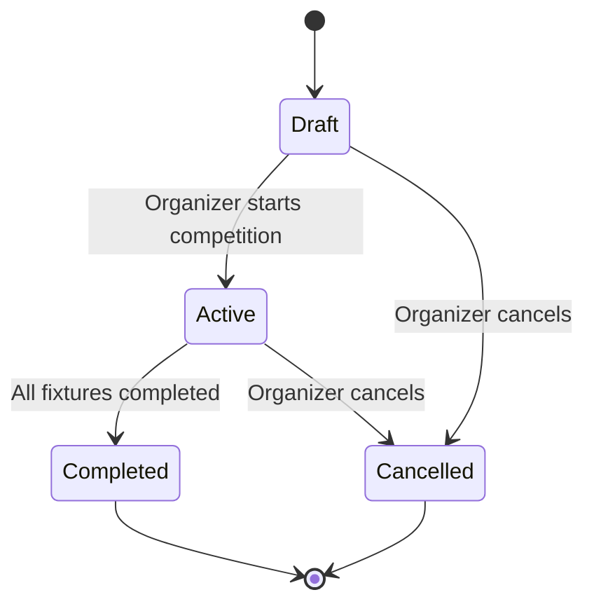
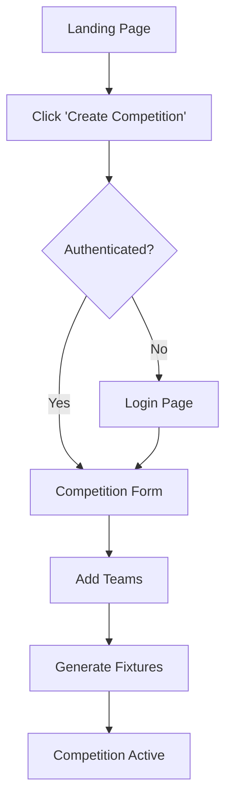
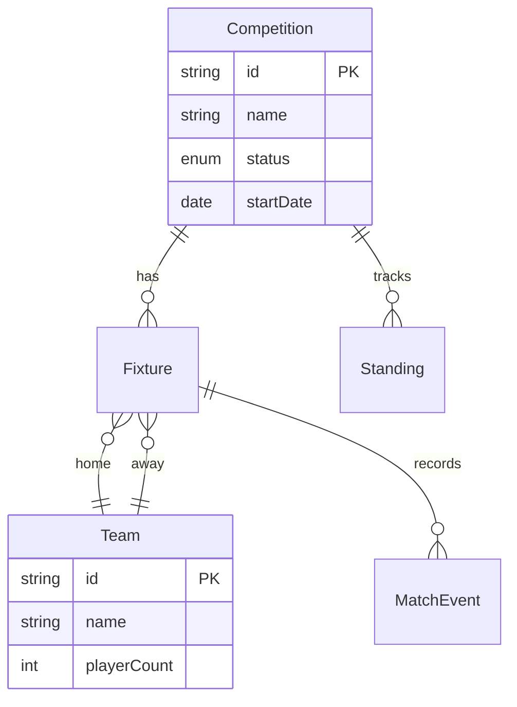

## User Input

```text
$ARGUMENTS
```

You **MUST** consider the user input before proceeding (if not empty).

## Goal

Extract structured data from specific PRD sections and generate Mermaid diagram syntax. Each diagram type maps to a specific PRD section. Output is saved as a `.mmd` file that can be rendered by any Mermaid-compatible viewer.

## Execution Steps

### 1. Resolve Input

Parse `$ARGUMENTS` for:
- **PRD path** (required) — path to the PRD file
- **Diagram type** (optional) — one of: `state-machine`, `user-flow`, `data-model`, `all`

If no diagram type is specified, default to `all` (generate all applicable diagrams).

If `$ARGUMENTS` is empty, abort with: "Please provide a PRD path and optional diagram type. Example: `/prd-diagram prd/my-feature/prd.md state-machine`"

Read the PRD file. If it does not exist, abort with a clear error message.

### 2. Determine Output Path

- Feature name from parent directory: `prd/my-feature/prd.md` → `my-feature`
- Output directory: `prd/<feature-name>/diagrams/`
- Output files: `<type>.mmd` (e.g., `state-machine.mmd`, `user-flow.mmd`, `data-model.mmd`)

### 3. Generate Diagrams

#### A. State Machine Diagram (`state-machine`)

**Source**: Section 10 — State Machines & Lifecycle

Extract state transition tables and generate Mermaid `stateDiagram-v2`:



**Extraction rules**:
- Each row in a state transition table becomes an arrow
- "From" column → source state
- "To" column → target state
- "Trigger" column → arrow label
- Add `[*]` for initial and terminal states
- If multiple entities have state machines, generate one diagram per entity (separate files: `state-machine-<entity>.mmd`)

#### B. User Flow Diagram (`user-flow`)

**Source**: Section 6 — User Stories & Flows

Extract numbered user flow steps and generate Mermaid `flowchart TD`:



**Extraction rules**:
- Each numbered step becomes a node
- Sequential steps become arrows
- Conditional steps (if/else, error paths) become diamond decision nodes
- Use descriptive labels on arrows for conditions
- Generate one diagram per major user flow (separate files: `user-flow-<flow-name>.mmd`)

#### C. Data Model Diagram (`data-model`)

**Source**: Section 8 — Data Model & Validation Rules

Extract entity definitions and relationships, generate Mermaid `erDiagram`:



**Extraction rules**:
- Each named entity/model becomes an ER entity
- Fields become attributes with types
- Required fields are marked
- Relationships inferred from foreign key references, "belongs to", "has many" language
- Use standard cardinality notation: `||--o{` (one-to-many), `||--||` (one-to-one), `}o--o{` (many-to-many)

### 4. Save & Report

1. Create the `diagrams/` directory if it doesn't exist.
2. Write each diagram to its output file.
3. Report:
   - Files created with paths
   - Diagram type and source section for each
   - Any sections that were missing or insufficient for diagram generation
   - Rendering hint: "Preview these files in any Mermaid-compatible viewer (VS Code, GitHub, Mermaid Live Editor)"

## Operating Principles

- Do not ask questions — this is a generator skill
- If a source section is missing or empty, skip that diagram type and note it in the report
- Generate clean, readable Mermaid syntax with proper indentation
- Use descriptive node labels (not cryptic IDs)
- Keep diagrams under 50 nodes — split into multiple diagrams if larger
- Never modify the source PRD
- If no diagram-worthy content is found, report: "No diagrammable content found. Ensure the PRD has State Machines (§10), User Flows (§6), or Data Model (§8) sections."
